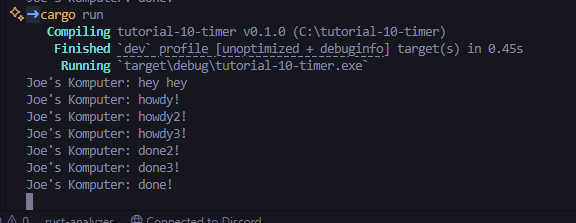
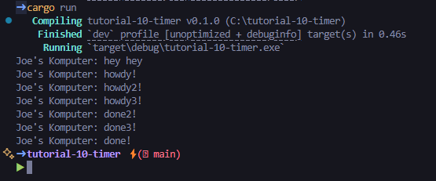

## Joe Mathew Rusli
## 2306152310 / Adpro A

## Eksperimen 1.2

Urutan eksekusi async dan hasilnya adalah seperti berikut
1.  `let (executor, spawner) = new_executor_and_spawner();`

executor dan spawner dibuat.

2.  `spawner.spawn(async { ... });`

Sebuah task baru dijadwalkan untuk dieksekusi secara async. Tasknya berisi `println!("Joe's Komputer: howdy!");`, menunggu 2 detik (`TimerFuture::new(Duration::new(2, 0)).await;`). `println!("Joe's Komputer: done!");`

3.  `println!("Joe's Komputer: hey hey");`

Baris ini dieksekusi segera setelah task dispawn, tanpa menunggu task tersebut selesai. Oleh karena itu, "Joe's Komputer: hey hey" akan muncul terlebih dahulu, atau setidaknya sebelum "Joe's Komputer: done!".

4.  `drop(spawner);`

Spawner dihentikan, menandakan tidak ada task baru lagi yang akan ditambahkan.

**Mengapa hasilnya seperti ini?**

Hasilnya demikian karena sifat async dari program. `spawner.spawn` tidak menunggu task selesai; ia hanya menjadwalkannya. Baris `println!("Joe's Komputer: hey hey");` berada di thread utama dan dieksekusi langsung. Sementara itu, task yang dispawn (`async { ... }`) berjalan secara terpisah ketika `executor.run()` dipanggil dan memproses antrian task. `println!("Joe's Komputer: howdy!");` dieksekusi saat task dimulai, diikuti oleh jeda, dan kemudian `println!("Joe's Komputer: done!");`.

Ini menunjukkan bagaimana Rust dapat menangani operasi yang memakan waktu (seperti timer atau I/O) tanpa memblokir thread utama, memungkinkan program tetap responsif.

## Eksperimen 1.3

Eksperimen dengan menghilangkan sementara baris `drop(spawner);` dari kode `main.rs` untuk melihat dampaknya pada eksekusi program

### Skenario 1: `drop(spawner);` Dikomentari

Ketika baris `drop(spawner);` dikomentari, executor tidak akan pernah tahu bahwa tidak ada lagi task baru yang akan datang. Akibatnya, `executor.run()` akan terus berjalan dan menunggu task baru di `ready_queue.recv()`. Karena tidak ada task baru yang masuk setelah tiga task awal selesai, program akan menggantung (hang) setelah mencetak semua "done!" dari setiap task. Program perlu dihentikan secara manual (misalnya dengan Ctrl+C).

Seperti yang terlihat pada screenshot, setelah semua task selesai (`done!`, `done2!`, `done3!`), program tidak berhenti. Ini karena `executor.run()` memiliki loop `while let Ok(task) = self.ready_queue.recv()`. Ketika `spawner` tidak didrop, channel `ready_queue` tetap terbuka. `recv()` akan terus memblokir thread, menunggu pesan baru yang tidak akan pernah datang ( sad actually :( ).

### Skenario 2: `drop(spawner);` Tidak Dikomentari

Ketika `drop(spawner);` ada dan dieksekusi, sender dari channel `task_sender` akan ditutup. Ini memberi sinyal kepada `ready_queue.recv()` bahwa tidak ada lagi pesan yang akan dikirim. Panggilan `recv()` kemudian akan mengembalikan `Err`, yang menyebabkan loop `while let Ok(task) = ...` di `executor.run()` berakhir, dan program pun berhenti secara normal setelah semua task selesai.

Dengan `drop(spawner);` aktif, setelah semua task yang dijadwalkan selesai diproses oleh executor, channel komunikasi ditutup. `ready_queue.recv()` akan gagal (mengembalikan `Err`), loop pada `executor.run()` berhenti, dan fungsi `main` selesai, sehingga program berhenti dengan bersih. Urutan pesan "done" mungkin bervariasi tergantung pada bagaimana sistem operasi menjadwalkan thread dan bagaimana executor mengambil task, tetapi yang pasti program akan berhenti.

**Kesimpulan:**

Peran `drop(spawner);` sangat krusial untuk memberi tahu executor bahwa tidak ada lagi pekerjaan yang akan datang, sehingga executor dapat menyelesaikan task-task yang tersisa dan kemudian berhenti dengan benar. Tanpa itu, executor akan menunggu tanpa batas.
