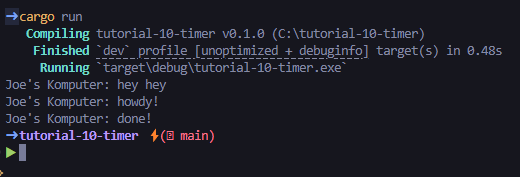

## Joe Mathew Rusli
## 2306152310 / Adpro A

## Eksperimen 1.2

Urutan eksekusi async dan hasilnya adalah seperti berikut
1.  `let (executor, spawner) = new_executor_and_spawner();`

executor dan spawner dibuat.

2.  `spawner.spawn(async { ... });`

Sebuah task baru dijadwalkan untuk dieksekusi secara async. Tasknya berisi `println!("Joe's Komputer: howdy!");`, menunggu 2 detik (`TimerFuture::new(Duration::new(2, 0)).await;`). `println!("Joe's Komputer: done!");`

3.  `println!("Joe's Komputer: hey hey");`

Baris ini dieksekusi segera setelah task dispawn, tanpa menunggu task tersebut selesai. Oleh karena itu, "Joe's Komputer: hey hey" akan muncul terlebih dahulu, atau setidaknya sebelum "Joe's Komputer: done!".

4.  `drop(spawner);`

Spawner dihentikan, menandakan tidak ada task baru lagi yang akan ditambahkan.

**Mengapa hasilnya seperti ini?**

Hasilnya demikian karena sifat async dari program. `spawner.spawn` tidak menunggu task selesai; ia hanya menjadwalkannya. Baris `println!("Joe's Komputer: hey hey");` berada di thread utama dan dieksekusi langsung. Sementara itu, task yang dispawn (`async { ... }`) berjalan secara terpisah ketika `executor.run()` dipanggil dan memproses antrian task. `println!("Joe's Komputer: howdy!");` dieksekusi saat task dimulai, diikuti oleh jeda, dan kemudian `println!("Joe's Komputer: done!");`.

Ini menunjukkan bagaimana Rust dapat menangani operasi yang memakan waktu (seperti timer atau I/O) tanpa memblokir thread utama, memungkinkan program tetap responsif.
